# Kinetic Bridge Email Intelligence

Inbound email → normalized event → CRM identity resolution → **contracted AI recommendations** with a human approval gate before any write.

This repo is the source of truth for an internship systems project aimed at **applied AI / data workflow engineering**: turning messy communication events into structured, validated state—not model training.

**Repo:** https://github.com/blakeallard/kinetic-bridge-email-intel

## What I built

- **Inbound event normalization** from TeamInbox webhooks into a stable message shape (`normalize_teaminbox_payload`).
- **Processing gates** so only eligible inbound mail continues (filters noise / non-actionable traffic early).
- **CRM identity resolution** with a single versioned `crm_context` schema across Contact → Lead → Account-by-domain → explicit `no_match` routes (read-only; no CRM writes on this path).
- **AI analysis contracts** — versioned request/response JSON Schemas plus policy rules (enum-limited recommendations, confidence bands, message-id idempotency, human approval, expiry).
- **Repo discipline for automation** — CI, regression tests for commit-sync tooling, and operational status/evidence docs for live Flow verification.

## Architecture

Target pipeline (AI + approval stages contracted; see status below):

```mermaid
flowchart LR
  A[TeamInbox / web form] --> B[Normalize + gate]
  B --> C[CRM identity match]
  C --> D[Unified crm_context]
  D --> E[Lifecycle snapshot]
  E --> F[AI structured analysis]
  F --> G[Validate recommendation]
  G --> H[AI_Recommendations pending]
  H --> I[Human approval]
  I --> J[Execution flow]
  J --> K[CRM / tasks / other systems]
```

Live proof-of-concept today ends at **unified `crm_context`** after identity match. AI invocation, recommendation persistence, approval, and execution are designed and schema-locked but not fully wired in runtime yet.

## Key engineering problems

| Problem | Approach |
| --- | --- |
| Messy inbound payloads | Normalize once; downstream steps consume one message contract |
| Ambiguous sender identity | Precedence Contact > Lead > Account domain > `no_match`, one output schema |
| Unsafe AI writes | Read-only analysis contract; human approval before execution |
| Hallucinated CRM state | Require an explicit lifecycle snapshot before AI; empty lists over guesses |
| Duplicate / replay risk | Message-id / idempotency key in the contract; re-check before execution |
| Drift between docs and runtime | Status + evidence captures; schemas in `artifacts/schemas/` |

## Current status

**Honest state:** production-style **prototype / internship system**, not a finished product.

| Stage | State |
| --- | --- |
| Shared inbox → TeamInbox intake | Live |
| Webhook → normalize → processing gate | Live (verified) |
| CRM identity → unified `crm_context` | Live (verified; read-only) |
| Deal/Case/Task lifecycle snapshot for AI | In progress / next |
| AI call + response validation | Contract + schemas ready; Flow not started |
| Human approval + execution flow | Designed; not implemented |

Details and evidence: [`STATUS.md`](STATUS.md), [`docs/ai-analysis-contract-v1.md`](docs/ai-analysis-contract-v1.md), [`artifacts/schemas/`](artifacts/schemas/).

## How to evaluate this repo (60 seconds)

1. Skim this README + the architecture diagram.
2. Open `docs/ai-analysis-contract-v1.md` and `artifacts/schemas/` for the AI I/O contract.
3. Open `STATUS.md` for what is live vs designed.
4. Open `tests/` + `.github/workflows/` for CI / regression discipline.

## Layout

| Path | Role |
| --- | --- |
| `docs/` | Contracts, handoff, runtime evidence notes |
| `artifacts/schemas/` | Machine-readable AI request/response schemas |
| `scripts/` | Supporting automation (e.g. commit sync helper) |
| `tests/` | Regression tests |
| `progress-pics/` | Sanitized verification screenshots |
| `STATUS.md` | Operational current state |
| `TASK.md` | Original task snapshot (internal) |
